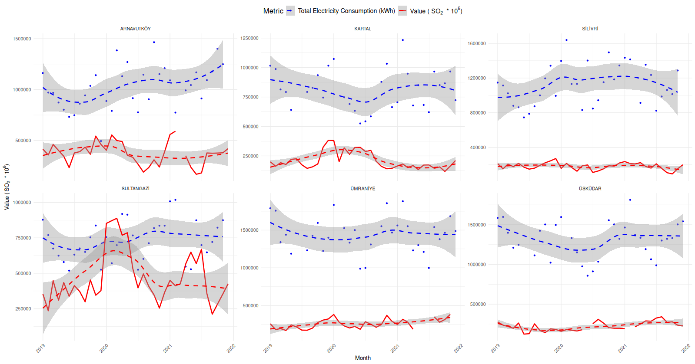
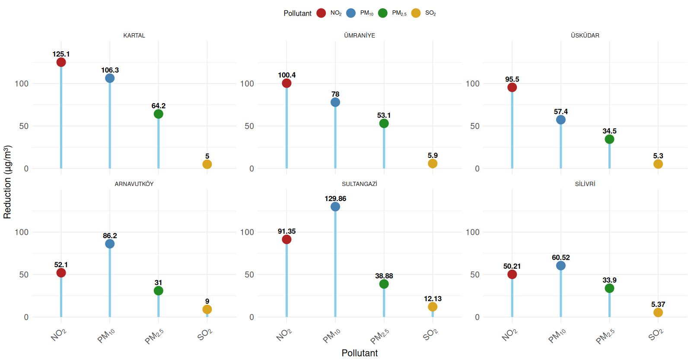
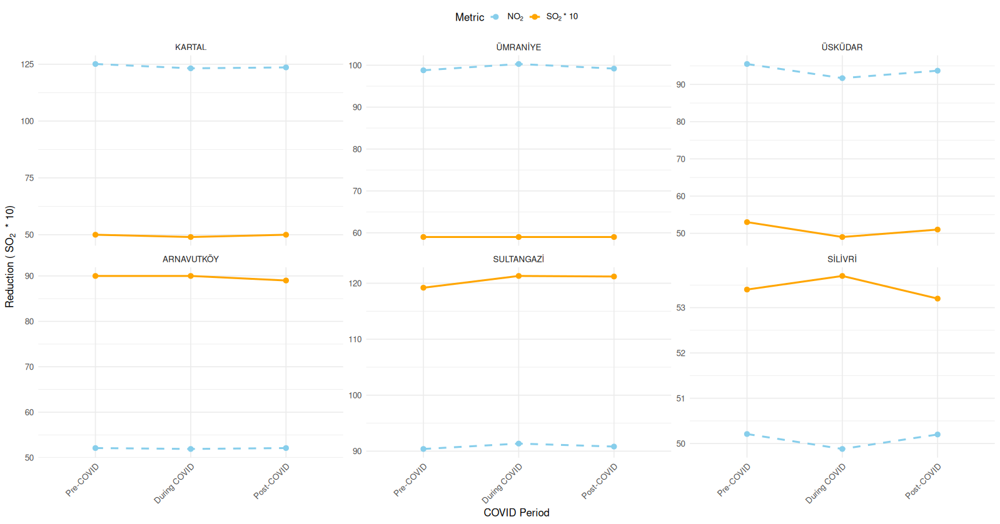

# Istanbul Air Quality - COVID-19 Analysis

## Overview

This repository hosts an R-based analysis of Istanbul's air quality during the COVID-19 lockdown. The study investigates the impact of reduced industrial activity and traffic on key pollutants (PM2.5, PM10, NO₂, SO₂) by leveraging electricity consumption data as a proxy for industrial activity. The project aims to provide actionable insights that can inform future environmental policies and urban planning strategies.

## Example Plots

Below are some example plots generated by the R scripts with ggplot2 library. These figures showcase the key aspects of the analysis.

## Related Paper

This repository is accompanied by a paper titled "Does Industrial Reductions Matter More than Traffic Reductions in Improving Air Quality During COVID-19 Lockdown Period in Istanbul?"

You can [view the full paper here](./hasanHuseyinBalbicakTermProject.pdf).

The R scripts and ggplot2 visualizations help extend the analysis for further insights into urban air quality management.

## Project Objectives

- **Analyze Air Quality Data:** Compare pollutant levels before, during, and after the COVID-19 lockdown in Istanbul.
- **Evaluate Pollution Sources:** Assess the relative contributions of traffic and industrial emissions on air quality.
- **Visualize Trends:** Use R and ggplot2 to create insightful visualizations that highlight trends and correlations in the data.
- **Inform Policy:** Provide data-driven insights to support more effective and localized environmental policies.

## Tools and Technologies

- **R Programming:** The primary language used for data cleaning, analysis, and visualization.
- **ggplot2:** A versatile R package for creating aesthetically pleasing and informative graphics.
- **tidyverse:** A collection of R packages including dplyr and tidyr for data manipulation and processing.
- **RStudio:** The integrated development environment (IDE) used to develop and run the analysis.